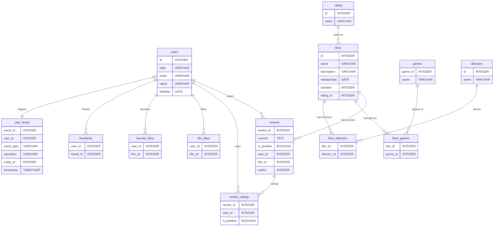

```mermaid
erDiagram
    users {
        id INTEGER
        login VARCHAR
        email VARCHAR
        name VARCHAR
        birthday DATE
    }
    films {
        id INTEGER
        name VARCHAR
        description VARCHAR
        releaseDate DATE
        duration INTEGER
        rating_id INTEGER
    }
    genres {
        genre_id INTEGER
        name VARCHAR
    }
    rating {
        id INTEGER
        name VARCHAR
    }
    directors {
        id INTEGER
        name VARCHAR
    }
    reviews {
        review_id INTEGER
        content TEXT
        is_positive BOOLEAN
        user_id INTEGER
        film_id INTEGER
        useful INTEGER
    }
    review_ratings {
        review_id INTEGER
        user_id INTEGER
        is_positive BOOLEAN
    }
    user_feeds {
        event_id INTEGER
        user_id INTEGER
        event_type VARCHAR
        operation VARCHAR
        entity_id INTEGER
        timestamp TIMESTAMP
    }
    film_likes {
        user_id INTEGER
        film_id INTEGER
    }
    favorite_films {
        user_id INTEGER
        film_id INTEGER
    }
    friendship {
        user_id INTEGER
        friend_id INTEGER
    }
    films_genres {
        film_id INTEGER
        genre_id INTEGER
    }
    films_directors {
        film_id INTEGER
        director_id INTEGER
    }

    users ||--o{ reviews : "writes"
    users ||--o{ review_ratings : "rates"
    users ||--o{ film_likes : "likes"
    users ||--o{ favorite_films : "favorites"
    users ||--o{ friendship : "friends"
    users }|--|| user_feeds : "triggers"

    films ||--o{ reviews : "has reviews"
    films ||--o{ films_genres : "has genres"
    films ||--o{ films_directors : "has directors"
    genres ||--o{ films_genres : "genres of"
    directors ||--o{ films_directors : "directs"

    rating ||--o{ films : "rated as"

    reviews ||--o{ review_ratings : "ratings"
```